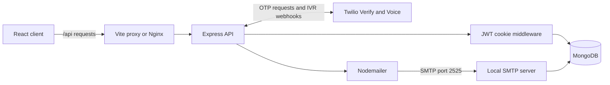
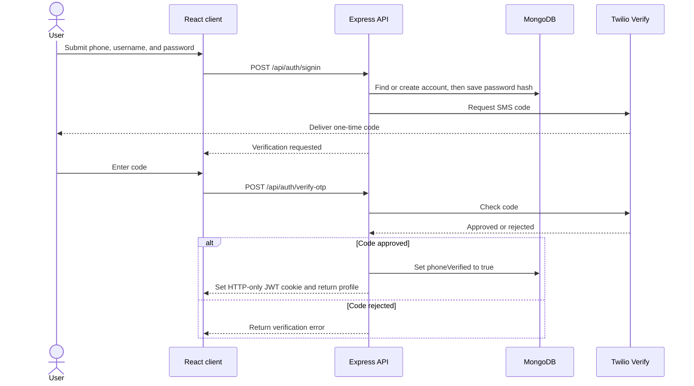
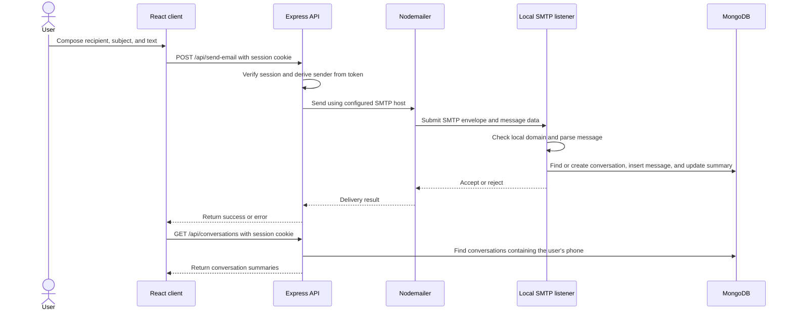
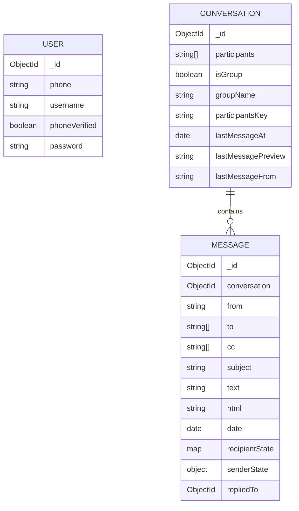

# PhoneMail

## Clone and Run

The quickest way to run PhoneMail on Windows is with Docker Compose. Install Git and Docker Desktop first, and make sure Docker Desktop is running.

1. Clone the repository and enter the project directory:

    ```powershell
    git clone https://github.com/HexTrail/Email-Client.git
    cd Email-Client
    ```

2. Create the backend environment file and open it for editing:

    ```powershell
    Copy-Item .env.example server/.env
    notepad server/.env
    ```

    Set `FRONTEND_URI=http://localhost:3000` and a long, unique `JWT_SECRET`. For live IVR calls, set `TWILIO_AUTH_TOKEN` so the backend can verify Twilio's webhook signature. To use phone sign-in and password recovery, also set `TWILIO_ACCOUNT_SID` and `TWILIO_VERIFY_SERVICE_SID`. These values come from your Twilio account. The Compose file supplies MongoDB and SMTP connection settings. The `server/.env` file must exist before Compose starts.

3. Build and start the services:

    ```powershell
    docker compose up --build -d
    ```

4. Open [http://localhost:3000](http://localhost:3000) and sign in or create an account. SMS verification will not work until the Twilio Verify values are configured.

5. To get the IVR tunnel URL, follow its logs:

    ```powershell
    docker compose logs -f ivr-tunnel
    ```

    Wait until the log shows `Registered tunnel connection`, then copy the `https://...trycloudflare.com` URL and press `Ctrl+C` to stop following logs. The containers continue running. Configure the Twilio number's **A call comes in** webhook with that URL plus `/voice/incoming`, using `HTTP POST`; see [IVR Setup in Compose](#ivr-setup-in-compose) for the exact Console steps. Cloudflare can print a URL before the tunnel is connected; don't use it until the connection is registered.

6. To inspect backend logs, run `docker compose logs -f backend` in another terminal. To stop the stack, run `docker compose down`. MongoDB data remains in the `mongo-data` volume; `docker compose down -v` also deletes that data.

The Compose stack exposes the client at port `3000`, the API at `5000`, SMTP at `2525`, and MongoDB at `27018`. Phone verification and optional IVR confirmation SMS require Twilio credentials.

PhoneMail is an in-development email client that uses phone numbers as account identifiers and groups mail into conversations. The repository includes a React/TypeScript client, an Express API, MongoDB persistence, Twilio phone verification, and a local SMTP delivery path.

## Capabilities

| Capability | Status |
| --- | --- |
| Phone-based sign-in/account creation with password | Implemented |
| SMS one-time-code verification and password recovery | Implemented; requires Twilio Verify credentials |
| HTTP-only JWT session cookie and protected API routes | Implemented |
| IVR account creation through a Twilio voice webhook | Implemented |
| Compose and send plain-text mail to local-domain addresses | Implemented through local SMTP |
| Conversation list and latest-message preview | Implemented |
| Full message history, folder actions, attachment upload, and search | Not implemented |
| Redis caching and end-to-end encryption | Planned; not implemented |

## Architecture

The browser sends `/api` requests to Express. The API handles identity and authorization. For mail submission, it passes the message to Nodemailer, which connects to the local SMTP listener. SMTP parses the message and persists it to MongoDB.



### Account Verification Flow



### Message Delivery and Conversation Listing



The conversation endpoint currently returns summaries, not full message history. The detail panel displays the latest-message preview saved on the conversation.

## Database Models

The Mongoose models are defined in `server/src/Models/`. `Message` references `Conversation` by MongoDB ObjectId. User participation is stored as phone strings rather than references to `User` documents; there is no automatic cascade when a user changes or is removed.



### User

`User` stores a required `phone` string, `username`, `phoneVerified`, and an optional `password`. The auth API validates phone numbers in international E.164 format. Keeping phone as a string preserves formatting and leading zeroes. Passwords set through the auth flow are bcrypt hashes; IVR-created users may not have a password yet. The database field is named `password`, though it contains the hash.

### Conversation

`Conversation` stores participant phone identifiers and whether the thread is a group. For one-to-one mail, the SMTP persistence path sorts participant identifiers and joins them into `participantsKey`; a partial unique index prevents duplicate one-to-one conversations. Messages to multiple recipients create a new group conversation rather than reusing an existing group. `lastMessageAt`, `lastMessagePreview`, and `lastMessageFrom` are denormalized for list rendering. Indexes support participant lookup by most recent activity.

### Message

`Message` references one conversation and stores sender/recipient addresses, subject, text/HTML bodies, attachment metadata, and dates. `recipientState` defines per-recipient read, favorite, and folder values; `senderState` defines sent, drafts, and trash state. Reply-chain fields connect a reply to its parent and mark whether the original has been answered. These fields are in the schema, but routes that manage most of these mailbox states are not yet implemented.

The current SMTP persistence path creates the message and updates the conversation summary, but does not populate recipient state or attachment records. No database migration, cascading delete, or retention policy is configured.

## HTTP API

Routes are mounted under `/api` unless the path begins with `/voice`. Protected routes require the `token` cookie issued after successful OTP verification.

| Method | Path | Access | Purpose |
| --- | --- | --- | --- |
| `POST` | `/api/auth/signin` | Public | Create/continue sign-in and request a code |
| `POST` | `/api/auth/verify-otp` | Public | Verify code, mark phone verified, issue session cookie |
| `POST` | `/api/auth/forgot-password` | Public | Request recovery code without revealing account existence |
| `POST` | `/api/auth/reset-password` | Public | Verify recovery code and replace password hash |
| `GET` | `/api/user` | Session | Return current user's profile |
| `POST` | `/api/signout` | Session | Clear session cookie |
| `POST` | `/api/send-email` | Session | Send plain-text mail through local SMTP |
| `GET` | `/api/emails` | Session | List messages addressed to the current user's generated address |
| `GET` | `/api/conversations` | Session | List conversation summaries for the current user |
| `POST` | `/voice/incoming` | Twilio webhook | Return IVR menu as TwiML |
| `POST` | `/voice/menu` | Twilio webhook | Process IVR selection and create account |

`POST /api/send-email` accepts `to` as a string or an array of strings, plus string `subject` and `text`. SMTP accepts only sender and recipient addresses at the configured `DOMAIN`, which defaults to `phonemail.test`.

## Requirements and Configuration

- Node.js 20 or newer and npm
- Docker Desktop with Compose for the containerized stack, or MongoDB for local backend development
- Twilio Verify credentials for SMS sign-in and recovery
- Twilio account credentials for signed IVR webhooks and SMS verification; a sender number is optional for IVR confirmation SMS

The backend loads configuration from `server/.env`. The root `.env.example` lists available variables. Copy it to `server/.env`, provide the values needed for your setup, and never commit real secrets.

| Variable | Purpose |
| --- | --- |
| `MONGO_URI` | MongoDB connection; Compose overrides this to use its `mongo` service |
| `FRONTEND_URI` | Credentialed CORS origin; Compose default is `http://localhost:3000`, local Vite uses `http://localhost:5173` |
| `JWT_SECRET` | Secret used to sign session tokens; use a long random value |
| `PORT` or `API_PORT` | Express port; defaults to `5000` |
| `SMTP_PORT` | SMTP listener port; defaults to `2525` |
| `SMTP_HOST` | Nodemailer target; defaults to `127.0.0.1` |
| `DOMAIN` | Accepted local email domain; defaults to `phonemail.test` |
| `TWILIO_ACCOUNT_SID`, `TWILIO_AUTH_TOKEN` | Twilio credentials; the Auth Token is used to verify signed voice webhooks |
| `TWILIO_VERIFY_SERVICE_SID` | Verify service for sign-in and recovery codes |
| `TWILIO_FROM_NUMBER` | Optional sender number for IVR confirmation SMS |

The receiving Twilio phone number is configured in the Twilio Console, not in `server/.env`. Set its **A call comes in** Voice webhook to the tunnel URL plus `/voice/incoming`. `TWILIO_FROM_NUMBER` is only for optional outgoing confirmation SMS; the IVR identifies the caller from Twilio's request and uses that caller's phone number for the account.

Compose requires `server/.env` to exist. It exposes MongoDB on host port `27018`, the API and SMTP listener on `5000` and `2525`, and the frontend on `3000`. The `ivr-tunnel` service starts a temporary public Cloudflare Quick Tunnel and prints its URL in that container's logs. No purchased domain, separate tunnel account, or separate tunnel installation is needed. Testers paste the printed webhook URL into the Twilio Console once per tunnel start.

### IVR Setup in Compose

Twilio cannot call `localhost`, so Compose starts a separate `ivr-tunnel` container. It provides a temporary public HTTPS URL and prints it in the tunnel container's logs. It does not change Twilio settings automatically.

1. Copy `.env.example` to `server/.env` and set `JWT_SECRET`, `TWILIO_ACCOUNT_SID`, and `TWILIO_AUTH_TOKEN`. Set `TWILIO_VERIFY_SERVICE_SID` too if testers will sign in to the client after creating an account by phone.
2. From the repository root, start the stack:

    ```powershell
    docker compose up --build
    ```

3. Run `docker compose logs -f ivr-tunnel`. Wait for `Registered tunnel connection`, then copy the HTTPS URL printed by Cloudflare.
4. In the [Twilio Console](https://console.twilio.com/), open **Phone Numbers > Manage > Active Numbers** and click the Voice-capable number that callers will dial. On its configuration page, find **Voice Configuration** and set **A call comes in** to **Webhook**. Paste the Cloudflare URL followed by `/voice/incoming` (for example, `https://example.trycloudflare.com/voice/incoming`), select **HTTP POST**, then save the configuration.
5. Call the Twilio number from a mobile phone and press `1` when prompted. Twilio sends the caller's number to PhoneMail, which creates the account for that caller and reads the generated mailbox address aloud.

Keep the Compose stack running while testing; stopping it makes that URL unavailable. The URL can change after a restart, so copy the new URL into the Twilio Console again. Cloudflare Quick Tunnels require an internet connection and are intended for development/testing, not production hosting.

The IVR call creates a phone-only account and reads the generated mailbox address. To use that mailbox in the client, sign in with the same phone number, choose a username and password, and complete phone verification. That verification step requires working Twilio Verify settings. The IVR confirmation SMS is optional and additionally requires `TWILIO_ACCOUNT_SID`, `TWILIO_AUTH_TOKEN`, and `TWILIO_FROM_NUMBER`.

## Run Locally

Install dependencies from the repository root:

```powershell
cd client
npm install
cd ..\server
npm install
```

Configure `server/.env` with a reachable `MONGO_URI`, `FRONTEND_URI=http://localhost:5173`, and `JWT_SECRET`. Add Twilio settings to enable verification. Start backend and client in separate terminals:

```powershell
cd server
node src/index.js
```

```powershell
cd client
npm run dev
```

Open `http://localhost:5173`. Vite proxies `/api` to `http://localhost:5000`. The Twilio voice webhook is served directly by Express on `/voice`; it is not a browser client route. The backend starts MongoDB, SMTP, and Express in one process; do not start `smtp-server.js` separately when using `index.js`.

## Tests and IVR Smoke Test

### Automated Checks

Run backend tests from `server/`:

```powershell
npm test
```

Run client checks from `client/`:

```powershell
npm run build
npm run lint
```

Backend tests use Node's built-in test runner and cover auth/OTP behavior, IVR responses and signature rejection, phone-string preservation, middleware, SMTP delivery, and matching IVR/mailbox domains. They use test doubles and do not require live MongoDB, Twilio credentials, a Twilio number, or a tunnel. Client build and lint checks also run without a live Twilio call.

### Live IVR Requirements

A real-call test through Docker Compose additionally requires:

- A running Docker Compose stack and internet access for the `ivr-tunnel` Cloudflare Quick Tunnel container. The host network must allow outbound Cloudflare Tunnel traffic on port `7844` (UDP for QUIC or TCP for HTTP/2).
- `TWILIO_AUTH_TOKEN` in `server/.env` so the backend can verify Twilio's signed webhook requests.
- A Voice-capable Twilio number with its **A call comes in** webhook set to the URL printed by Compose, using `HTTP POST`.
- A caller able to reach the Twilio number. Trial-account restrictions may affect outbound SMS or Verify delivery during the later client sign-in step.

Twilio Verify credentials are only needed to complete sign-in to the web client after the IVR creates the account. IVR confirmation SMS is also optional. A successful request to `http://localhost:5000/voice/incoming` only checks local routing; it does not test the public tunnel or a real call.

## Security and Operational Boundaries

- Passwords are bcrypt-hashed. JWTs are issued in an HTTP-only cookie, marked `secure` in production, with `sameSite: strict`.
- The local SMTP server permits unauthenticated connections, disables STARTTLS, and only checks that envelope addresses use the configured domain. It is not safe to expose to an untrusted network or use as a production mail server.
- Voice webhook requests are checked using Twilio's request signature. The Quick Tunnel still exposes the local API on a temporary public URL, so use it only for controlled development/testing.
- Message bodies pass through the server and are stored in MongoDB as plaintext. End-to-end encryption is not implemented.
- Full thread retrieval, folder mutations, attachment upload, search, and spam handling are not complete API workflows.
- Docker Compose is a development environment, not a production deployment configuration.

## Repository Layout

```text
client/                   React, TypeScript, and Vite application
  src/Context/             Authentication state and API calls
  src/components/home/     Mail interface components
  src/pages/               Sign-in, verification, recovery, and home pages
server/
  src/Models/              Mongoose schemas
  src/Middleware/          JWT authentication middleware
  src/routes/              Auth, email, and voice routes
  src/index.js             API, MongoDB, and SMTP startup
  src/mailer.js            Nodemailer SMTP client
  src/smtp-server.js       Local SMTP receiver and persistence
  test/                    Backend tests
docker-compose.yml         Local MongoDB, API, and frontend services
