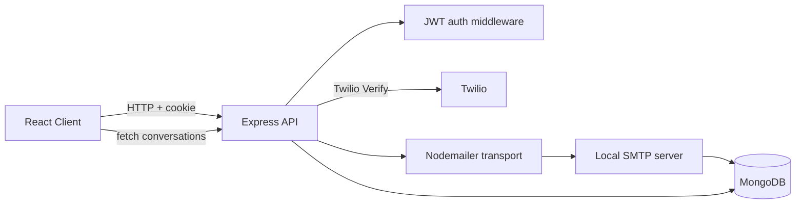

# PhoneMail Architecture and Data Flow

This project is a phone-first email client where each user is identified by a phone number, the app is organized as a chat-like inbox, and email delivery is handled by a local SMTP server backed by MongoDB.

The codebase is split into two main runtime layers:

- Frontend: React + TypeScript + Vite in `client/`
- Backend: Express.js API + MongoDB + local SMTP listener in `server/`

---

## 1. High-Level System View

At runtime, the app behaves like this:

- The browser loads the React client and initializes authentication state.
- The client calls the Express API over HTTP with credentials enabled.
- The API authenticates users using an HTTP-only JWT cookie.
- The API can either:
  - manage identity / OTP verification / session state, or
  - send and retrieve email data.
- Outgoing mail is not sent directly to the internet. It goes through a local Nodemailer transport that delivers to the app's own SMTP server.
- The SMTP server validates recipients and stores the message in MongoDB.
- The inbox UI reads conversation summaries and message metadata from MongoDB via the API.



---

## 2. Runtime Topology

### Frontend

The frontend is a Vite app in `client/`.

Key files:

- `client/src/main.tsx` mounts the app with routing and context providers.
- `client/src/App.tsx` defines routes for sign-in, verification, password reset, and the protected home view.
- `client/src/Context/AuthContext.tsx` owns the session state and talks to `/api/user`, `/api/auth/signin`, `/api/auth/verify-otp`, and `/api/signout`.
- `client/src/pages/Home.tsx` is the main authenticated inbox.
- `client/src/components/home/*` render the conversation list, detail panel, search, and compose modal.

The app is built around a single primary authenticated page:

- `/` → sign-in screen
- `/verify` → OTP verification step
- `/forgot-password` → recovery flow
- `/home` → protected inbox and conversation view

The client does not hold a separate server-side store; it keeps session state in React and uses API calls whenever it needs fresh data.

### Backend

The backend is an Express app started in `server/src/index.js`.

Its startup sequence is:

1. configure CORS for the frontend origin
2. parse JSON and URL-encoded request bodies
3. attach cookie parsing
4. mount `/api` routes and `/voice` routes
5. connect to MongoDB with retry logic
6. start the local SMTP server on `SMTP_PORT`
7. listen on the API port (`PORT` / default `5000`)

This means the project intentionally runs both an HTTP API and a pseudo-mail server in the same Node process.

### Database

MongoDB stores user accounts, conversations, and individual messages.

Relevant model files:

- `server/src/Models/Users.js`
- `server/src/Models/Conversation.js`
- `server/src/Models/Message.js`

The system chooses a phone-number-based identity model rather than a typical email-address user model.

---

## 3. Authentication and Session Model

### Phone-based identity

Users are identified by phone number. Sign-in and recovery accept a 10-digit national number; the server stores and sends it as an E.164 number using the default `+91` country code for Twilio. Mailbox addresses use the national number without a country-code prefix, such as `9876543210@phonemail.test`.

The auth route logic in `server/src/routes/auth.js` does the following:

- validates the request with Zod schemas
- finds or creates a `User` by phone
- hashes the password using bcrypt if it is new or being reset
- triggers Twilio Verify SMS to send a one-time code
- returns a success message and stores the phone in the client as pending OTP state

For local development only, `DEV_OTP_BYPASS=true` skips SMS delivery and OTP entry during sign-in, marks the account phone as verified, and issues the normal session cookie. The backend ignores this flag when `NODE_ENV=production`. Keep it disabled outside local development; password recovery continues to require Twilio Verify.

### OTP verification flow

The client stores the phone number in `sessionStorage` while waiting for OTP,
then calls:

- `POST /api/auth/verify-otp`

The server:

- finds the user by phone
- calls Twilio Verify to check the code
- marks `phoneVerified = true`
- signs a JWT containing user identity information
- sets an HTTP-only cookie named `token`
- responds with the user profile to the browser

The JWT is then attached automatically by the browser for future same-site requests.

### Protected requests

`server/src/Middleware/auth.js` is the session gate.

It:

1. reads `req.cookies.token`
2. verifies the JWT with `JWT_SECRET`
3. attaches `req.user` with:
   - `id`
   - `phone`
   - `email` derived from the phone and domain
   - `name` or username
4. blocks requests with `401` if the token is missing or invalid

This is how the app protects mail routes and user lookup routes.

---

## 4. Email Address Model

The app does not use a conventional email provider. Instead, phone numbers are converted into mailbox addresses using `getMailboxAddress()` from `server/src/mailbox.js`.

Example:

- stored phone: `+919876543210`
- mailbox address: `9876543210@phonemail.test`

This is intentionally simple and deterministic:

- the local part is the national phone number without the default `+91` prefix
- the domain is `phonemail.test` by default, or `process.env.DOMAIN`

This gives each user a pseudo-email address that can be used as a recipient in the app, without needing a full external mail system.

---

## 5. Sending Email: Request Flow

The send-email user flow begins in the React modal.

### Client flow

`client/src/components/home/ComposeModal.tsx`:

- collects `to`, `subject`, and `text`
- validates at least one recipient and message content
- sends:

```http
POST /api/send-email
```

with `withCredentials: true` so the cookie is sent.

### API flow

`server/src/routes/email.js` handles `POST /api/send-email`.

It:

- requires the auth middleware
- reads the authenticated phone from `req.user.phone`
- builds the sender address with `getMailboxAddress(req.user.phone)`
- normalizes the recipient list
- calls `sendMailMessage({ from, to, subject, text })`

The route does not write directly to MongoDB. It delegates message delivery to the mailer, which is designed to send through the app's own SMTP server rather than bypassing the local mail pipeline.

### Mailer flow

`server/src/mailer.js` creates a Nodemailer transport pointed at the local SMTP listener:

- `host`: `127.0.0.1` or `SMTP_HOST`
- `port`: `SMTP_PORT` (default `2525`)
- STARTTLS is required. The listener binds to `127.0.0.1` inside the backend container, so SMTP AUTH is unnecessary for this private process-to-process hop.

The backend generates an ephemeral localhost certificate, and the mailer trusts that exact certificate. Compose does not publish the SMTP port; only the authenticated API can initiate mail delivery.

---

## 6. SMTP Delivery and Persistence

The true persistence point is `server/src/smtp-server.js`.

This file creates a real SMTP server using `smtp-server` and `mailparser`.

### Why this matters

The app is built as if the domain is a real email domain. Mail only passes if the envelope sender and recipients are on the configured domain, such as `@phonemail.test`; a supplied `From` header must match the envelope sender. SMTP requires STARTTLS and is reachable only over backend loopback.

This prevents open relaying and keeps mail inside the project’s own address space.

### SMTP event flow

The SMTP server processes each message in stages:

1. `onMailFrom` validates that the sender address belongs to the configured local domain.
2. `onRcptTo` validates each recipient address belongs to the same domain.
3. `onData` receives the raw email stream.
4. `simpleParser` parses the raw RFC 5322 message into structured fields.
5. the parsed values are passed to `persistMessage()`.

### Message persistence

`persistMessage` in `smtp-server.js` does the actual MongoDB write.

It:

- converts sender and recipients to lowercase
- extracts participant phone numbers from addresses
- builds a conversation key for 1:1 conversations by sorting the participant numbers and joining them into a `participantsKey`
- upserts a `Conversation` document or creates one for group threads
- creates a `Message` document with:
  - `conversation`
  - `from`
  - `to`
  - `subject`
  - `text`
  - `html`
  - `date`
   - a per-recipient `recipientState` folder initialized as `inbox` or `spam`
   - parsed attachment content and metadata
- updates the conversation's `lastMessageAt`, `lastMessagePreview`, and `lastMessageFrom`

Before persistence, `isLikelySpam()` applies a small heuristic using suspicious subject phrases, suspicious content phrases, and a high URL count (three or more). At least two matching signals place each recipient's copy in Spam. This is basic filtering, not a production spam engine.

This means that the database is not populated by the HTTP API directly for outgoing email. Instead, the SMTP layer is the canonical delivery path and database writer.

---

## 7. Conversation Model and Threading

### Conversation collection

The `Conversation` model in `server/src/Models/Conversation.js` treats the inbox as a chat-style conversation list rather than a traditional mail folder. Each conversation is group by participants.

Important properties:

- `participants`: an array of phone identifiers
- `isGroup`: whether it is a multi-recipient thread
- `groupName`: optional label for a group
- `participantsKey`: a deterministic identifier for 1:1 threads
- `lastMessageAt`: timestamp for newest message
- `lastMessagePreview`: cached preview text for list rendering
- `lastMessageFrom`: sender identity for the latest message

The model adds an index to enforce a single 1:1 conversation per pair of participants while allowing multiple group threads.

### Message collection

`Message` documents represent each email. They include:

- `conversation` reference
- sender/recipient addresses
- subject and message body
- attachment metadata
- `recipientState` map for read/favorite/folder values per recipient
- `senderState` for sent/drafts/trash
- reply-chain metadata
- `createdAt` / `updatedAt`

Recipient folder state is independent for each phone number, so moving a group message for one recipient does not move it for the others. A recipient can have `inbox`, `spam`, or `trash` state; the sender copy has `sent`, `drafts`, or `trash` state. Missing legacy recipient state is interpreted as `inbox`. Trash is reversible and does not permanently delete a message. Reply-chain behavior remains separate from these folder actions.

---

## 8. Conversation Loading on the Client

The authenticated inbox fetches conversation summaries from the API via:

```http
GET /api/conversations?folder=conversations
```

The `folder` parameter accepts `conversations`, `spam`, or `trash`. The API derives each folder's conversations from messages visible to the authenticated user and uses the newest visible message for its summary. `Home.tsx` loads the selected folder and selects a conversation when the user clicks it. The detail panel fetches its ordered message history with:

```http
GET /api/conversations/:conversationId/messages?folder=conversations
```

Messages can be moved or restored with the authenticated endpoint:

```http
PATCH /api/messages/:messageId/folder
Content-Type: application/json

{ "folder": "trash" }
```

The request accepts `inbox`, `spam`, `trash`, or `restore`. Only received mail can be marked as spam. `restore` returns received mail to `inbox` and a sender's own copy to `sent`; both are shown in the Conversations view because there is no separate Sent sidebar folder.

The UI splits the mailbox into:

- left sidebar for folders and compose action
- middle list pane showing conversation rows
- right detail pane showing the selected conversation's messages and per-message folder actions

The list summary is derived from the latest message visible in the selected folder. Message history, Spam, Trash, and restore actions are available; advanced search and permanent deletion are not implemented.

---

## 9. Voice / IVR integration

The project has Twilio voice support in `server/src/routes/voice.js`.

This is a separate runtime pathway from the mail flow:

- `/voice/incoming` returns TwiML greeting and a menu
- `/voice/menu` receives the pressed digit and caller information
- if the caller presses `1`, the server checks if a user exists for the caller's phone number
- if not, it creates a `User` record and announces the generated mailbox address
- optional SMS confirmation can be sent via Twilio

The route validates the request signature using `twilio.validateRequest`, which is important because Twilio webhooks are otherwise untrusted input.

This is how the app supports “phone-based account creation” via a call instead of only SMS verification.

---

## 10. Full Data Flow Example

### Example: user signs in and sends a message

1. User enters phone + password on the React sign-in page.
2. Client calls `POST /api/auth/signin`.
3. Backend validates input and creates or updates the `User` record.
4. Backend calls Twilio Verify and sends an SMS OTP.
5. User enters the code in the verification form.
6. Client calls `POST /api/auth/verify-otp`.
7. Backend confirms the code, marks the user as verified, and issues a JWT cookie.
8. User enters the inbox.
9. Client fetches `GET /api/conversations?folder=conversations` with credentials.
10. The API finds messages visible to the authenticated phone and returns their conversation summaries.
11. User clicks compose and submits `POST /api/send-email`.
12. Server derives sender mail address from the phone and uses Nodemailer.
13. Nodemailer sends the message to the local SMTP listener.
14. The SMTP server validates the domain, parses the raw email, runs the basic spam heuristic, and persists it with per-recipient folder state and attachments.
15. The same message updates the conversation summary and timeline metadata.
16. The conversation list refreshes and renders the newest message visible in the selected folder.

---

## 11. Security and Operational Constraints

Several design choices make this a focused prototype rather than a production email stack:

- CORS is configured to the frontend origin and credentials are enabled.
- Authentication is handled by an HTTP-only secure JWT cookie.
- Twilio webhook requests are validated by signature.
- SMTP is configured to accept only the app's own domain (`phonemail.test` by default).
- The system trusts localhost SMTP and lacks a full TLS certificate setup.
- The app is intentionally local/dev-oriented and does not implement a large-scale mail delivery stack.

The code also assumes a single-process Node service for both API and SMTP responsibilities, which is fine for a prototype but not a distributed production architecture.

---

## 12. Architectural Summary

This project is best understood as a small internal mail platform built around these principles:

- identity is phone-based, not email-based
- the browser uses a standard React client with session state in context
- the backend is an Express app with route-level auth
- mail is delivered through a local SMTP server rather than directly to a remote SMTP provider
- MongoDB is the source of truth for users, conversations, and messages
- Twilio handles OTP verification and optional voice-based onboarding

The architecture is intentionally compact and pragmatic: it is designed to model an email system in a single app repository without introducing a full-scale mailbox infrastructure stack.

---

## 13. Practical Mental Model

If you want to reason about the system quickly, think of it in three layers:

1. Client layer
   - React state and UI decisions
   - auth + conversation rendering + compose modal

2. API layer
   - Express routes
   - JWT validation
   - Twilio calls
   - mail submission orchestration

3. Persistence / mail layer
   - SMTP server validates and parses message delivery
   - MongoDB stores conversations and message documents

In other words: the browser talks to the API, the API orchestrates auth and mail submission, and the SMTP server is the actual message ingestion path that writes to MongoDB.
